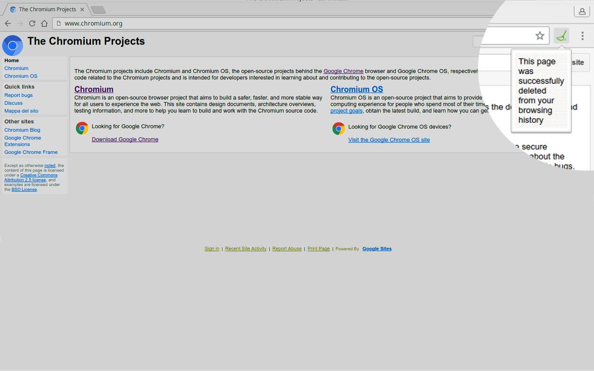

# Forget That Page  
We all at some point ended up on a webpage that we don't want to appear on our browsing history. Either it's for a gift, or a dumb page...

With "Forget That Page", you can delete from your history the webpage you're on, just in one click !

It's simple but useful, and also open source !

## How to use it

### Stable version
Download it from the Google Chrome web store :
https://chrome.google.com/webstore/detail/forget-that-page/nolcpahhgjbmaoemlhaiplpjlljaefic

### Unstable version
- Download the "chrome" folder on your computer
- Go to "chrome://extensions/" on your Chromium/Google Chrome browser
- Allow developer mode
- Select "load unpacked extension"
- Browse to the "chrome" folder

## Versions

### Version 1.2.3 - 28/09/2016
- Default icon when tab is created
- Use of messages.json for internationalization
- Added Spanish (may be slightly incorrect)

### Version 1.2.2 - 26/09/2016
- Icon on the "chrome://extension" view
- Code comments

### Version 1.2.1 - 25/09/2016
- Green icon when current page is not on the history
- New description
- Better file hierarchy
- Slightly better design

### Version 1.1.0 - 24/09/2016
- Three-numbers versioning (major.minor.small change)
- Display message from javascript
- Message in French or English
- Icon color change : green when deleted, back to normal when refresh or page change

### Version 1.0 - 23/09/2016
- Deletes the current page from history and displays a message
- For Chromium/Google Chrome

#### Note
Minor version number is incremented when a new feature is added.

Revision number is incremented when code is changed but no new feature is added.

## Incoming features
- Delete from recently closed too
- Delete other things than history (cookies, local storage... )
- Images for the store view
- Better general design
- More languages supported
- Firefox version
- (Blacklist option (delete automatically every page from a website))

## License
This program is free software: you can redistribute it and/or modify
it under the terms of the GNU General Public License as published by
the Free Software Foundation, either version 3 of the License, or
(at your option) any later version.

This program is distributed in the hope that it will be useful,
but WITHOUT ANY WARRANTY; without even the implied warranty of
MERCHANTABILITY or FITNESS FOR A PARTICULAR PURPOSE.  See the
GNU General Public License for more details.

You should have received a copy of the GNU General Public License
along with this program.  If not, see <http://www.gnu.org/licenses/>.

## References
Icon made by Freepik from www.flaticon.com

Background pattern from www.subtlepatterns.com
